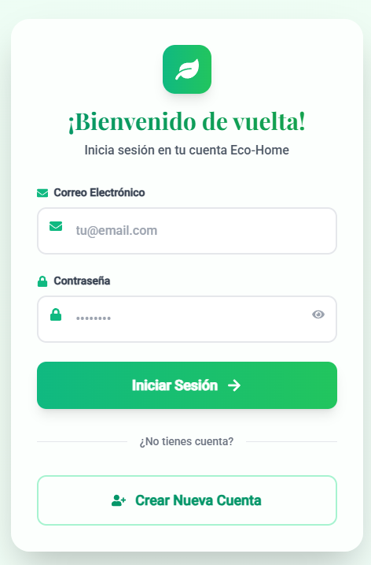
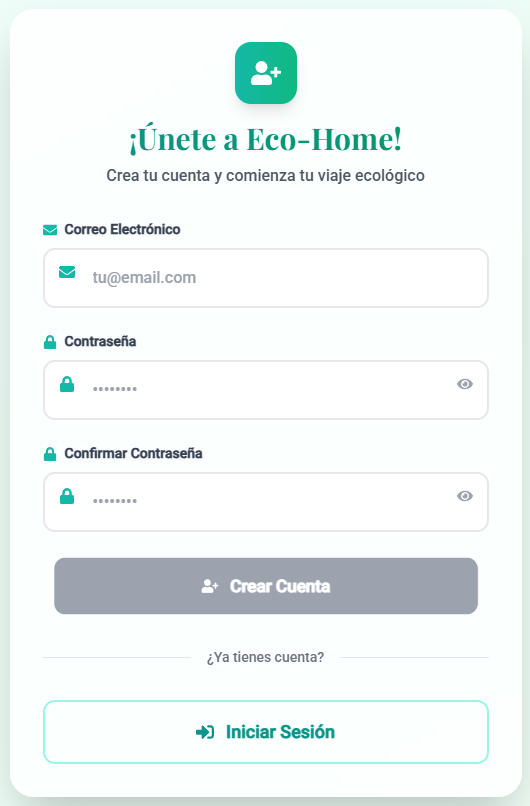
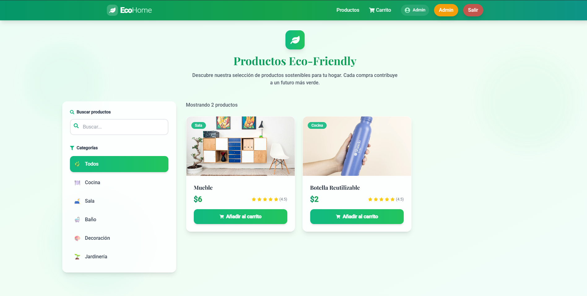
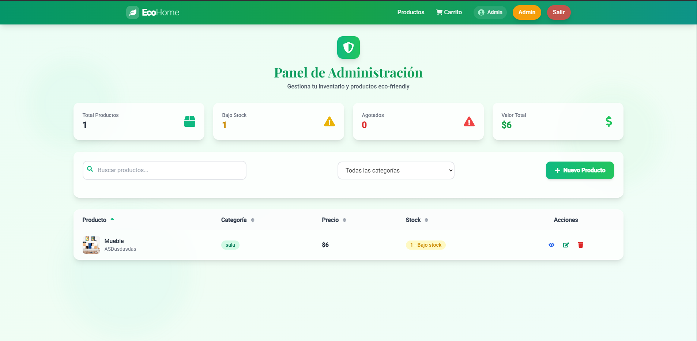

# Eco-Home Goods Store
Eco-Home: Tienda online de productos ecológicos para el hogar. Full stack con React, Node.js y MongoDB. Incluye autenticación, carrito de compras, filtrado por categorías y panel admin. Proyecto ideal para portafolio mostrando diseño responsivo y conciencia sostenible

## Tecnologías Utilizadas

Este proyecto fue desarrollado utilizando un stack de tecnologías que incluye:

- **Frontend**: React, Tailwind CSS
- **Backend**: Node.js, Express
- **Base de Datos**: MongoDB
- **Infraestructura**: Docker, Docker Compose
- **Autenticación**: JSON Web Tokens (JWT)
- **Otras Herramientas**: Axios, React Router, dotenv

## Características

- Autenticación de usuarios con JWT: Los usuarios pueden registrarse e iniciar sesión de forma segura, y se les asigna un token JWT para acceder a rutas protegidas.
- Carrito de compras: Los usuarios pueden agregar productos a un carrito de compras, modificar cantidades y proceder al pago.
- Filtrado por categorías: Los productos se pueden filtrar por categorías para facilitar la búsqueda.
- Panel de administración: Los administradores pueden gestionar productos, pedidos y usuarios desde un panel dedicado.
- Diseño responsivo: La aplicación se adapta a diferentes tamaños de pantalla y dispositivos, ofreciendo una experiencia de usuario óptima en móviles y desktops.

## Desafíos y Aprendizajes

- Integración MERN: Sincronicé la lógica del backend con el estado y los componentes del frontend, usando un proxy de Vite para facilitar la comunicación durante el desarrollo.
- Gestión de Estado: Implementé Context API para centralizar la autenticación y la gestión del carrito, evitando el "prop drilling" y manteniendo un código más limpio.
- Autorización: Desarrollé un middleware de Express para proteger las rutas del administrador, demostrando una comprensión de la seguridad en APIs.
- Desarrollo Consistente: El uso de Docker Compose garantizó que la base de datos estuviera configurada de la misma manera para cualquier persona que trabaje en el proyecto.

## Componentes

### Login

### Registro

### Catálogo de Productos

### Panel de Administración

